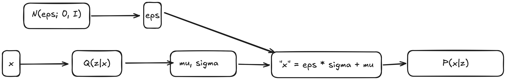

- Type of LVM where each output sample $\hat{x}$ is generated from a **latent representation** $z$.
- $z$ is sampled from some $P(z) \in \mathbb{R}^d$ assuming that $\int_{z}P$ is **tractable** and $P(z)$ is easy to sample from.
- $\hat{x} = P_{\theta}(x | z) \in \mathbb{R}^m$ where $P_\theta$ is some decoder with params $\theta$
- Architecturally, a VAE has an **encoder** and **decoder**. In literature, the encoder is usually referred to as $Q$ and the decoder $P$(this is also true for diffusion models)
    - So actually, the encoder is $Q_{\phi}(z | x)$ which is an encoder which outputs a **probability distribution** over $z$ given $x$
    - And the decoder $P_{\theta}(x | z)$ outputs a **probability distribution** over $x$ given $z$
- It is possible to force $Q_{\phi}$ to output a specific kind of distribution. Take for example a gaussian. Our gaussian needs a mean $\mu_z$ and covariance martrix $\Sigma$ given $x$.
    - Note: the positivity of $\Sigma$ is enforced by squaring the matrix, or by other means. It **CANNOT** be negative
- With this, it is possible to use MLE to train both $\phi$ and $\theta$. The goal is to maximize the log-likelihood of the training data, or maximize $\log{P_{\theta}(x)}$. $Q$’s params can also be learned.
- This optimization is pretty famous. It’s called the ELBO, or **Evidence Lower Bound.**
- **REALLY BORING MATH SECTION SKIP IF READING FOR FUN**
    - MLE Derivation
        
        $$
        \log{P(x) =  log \int_z} P(x, z)dz
        $$
        
        $$
        =  log \int_z P(x | z) P(z)dz \ \ \ \ \ \  (\text{by defn. of conditional prob.)}
        
        $$
        
    - **NOT TRACTABLE!!!!!**
        - This is the product of a gaussian $P(z)$ and a neural network $P(x|z)$. We can’t even use Bayes’ Rule since there is no way to find $P(x)$
        - This is the reason for using the encoder (outside of representation in latent state).
            
            $$
             \log{\int_z}P(x | z)P(z)dz = \log{\int_z}Q(z | x)\frac{P(x | z)P(z)}{Q(z|x)}dz \ \ \ \text{can also be interpreted as } \mathbb{E}[Q(z|x)]
            $$
            
    - With the prior formulation, we can employ [Jensen's Inequality](https://en.wikipedia.org/wiki/Jensen%27s_inequality) which states that if $X$ is a random variable and $\phi$ is a convex function, then $\phi(\mathbb{E}[X]) \leq \mathbb{E}[\phi(X)]$  (just random greek letters here, could be literally anything. This is what the wikipedia example used). We can invert the inequality and find the opposite to fulfill the inequality.
        
        $$
        \log{\int_z}Q(z | x)\frac{P(x | z)P(z)}{Q(z|x)}dz \geq 
        {\int_z}Q(z | x) \log{ \Biggl( P(x|z)\frac{P(z)}{Q(z|x)} \biggr)}dz 
        $$
        
    - It can be shown that if $Q(z|x) = P(z|x)$ then the inequality becomes an equality (they are opposites, after all), and the bound becomes tight. A good enough $Q$ can do this. Thus, the terms can be expanded
    
    $$
    =  \int_z Q(z | x) \log{\frac{P(z)}{Q(z|x)}}dz + \int_z Q(z | x) \log P( x | z) dz
    $$
    
    $$
    = -D_{KL}(Q(z | x) || P(z) + \mathbb{E}_Q[\log{P(x | z)}] 
    $$
    
    - Quick aside. The [KL Divergence](https://en.wikipedia.org/wiki/Kullback%E2%80%93Leibler_divergence) between 2  distributions of a continuous random variable is equivalent to the equation below This is important since most literature on generative modeling assumes you know this…
        
        $$
        D_{KL}(P || Q) = \int_{-\infty}^\infty
         p(x) \log \frac{p(x)}{q(x)}dx 
        $$
        
- Training
    - Naively, you would want to create the encoder $Q_{\phi}$ and decoder $P_{\theta}$
    - Then you would want to init the params (kaiming, xaivier, whatever)
        - For each minibatch
            - select n examples
            - compute $\mu_i, \sigma^2_i = Q_{\phi}(z_i | x_i) \ \forall i \in n$
            - sample $z \sim \mathcal{N}(\mu, \sigma^2)$
            - Backprop through the loss to update both params.
                - $\log P_{\theta}(x_i | z_i) - D_{KL}(Q_{\phi}(z_i, x_i || \mathcal{N}(z; 0, I))$
            
            **Problem: The chain up to** $z$ **is fine, but** $z \rightarrow \mu , \sigma^2$ **is not differentiable**
            
            **Solution: output** $\mu, \sigma^2$ **as values and toss them into a distribution**
            
            {width=720 height=240}    
- Toy example to fit to a fake curve
    
    ```python
    import numpy as np
    import matplotlib.pyplot as plt
    from scipy import integrate
    import torch.nn as nn
    import torch
    import torch.nn.functional as F
    
    np.random.seed(67)
    torch.manual_seed(67)
    
    def generate_simple_data(n_samples=100):
        data = np.random.randn(n_samples, 1)
        return data
        
        
      
    def likelihood_p_x_given_z(x, z, theta=1.0):
        mean = z + theta
        return np.exp(-0.5 * (x - mean)**2) / np.sqrt(2 * np.pi)
    
    def prior_p_z(z):
        return np.exp(-0.5 * z**2) / np.sqrt(2 * np.pi)
    
    def compute_true_log_probability(x, theta=1.0, z_range=(-5, 5)):
        def integrand(z):
            return likelihood_p_x_given_z(x, z, theta) * prior_p_z(z)
    
        integral, bounds = integrate.quad(integrand, z_range[0], z_range[1])
        return np.log(integral + 1e-10) 
        
        
    class SimpleEncoder(nn.Module):
        def __init__(self, input_dim=1, latent_dim=1, phi=1.0):
            super(SimpleEncoder, self).__init__()
            self.phi = nn.Parameter(torch.tensor(phi))
            self.log_var = nn.Parameter(torch.tensor(0.0)) 
            for param in self.parameters():
                param.requires_grad = False
            
        def forward(self, x):
            mean = self.phi * x
            logvar = self.log_var.expand_as(mean)
            return mean, logvar
            
    class SimpleDecoder(nn.Module):
        def __init__(self, latent_dim=1, output_dim=1):
            super(SimpleDecoder, self).__init__()
            self.theta_bias = nn.Parameter(torch.tensor(0.0))
            
        def forward(self, z):
            reconstruction = z + self.theta_bias
            return reconstruction
            
            
    class SimpleVAE(nn.Module):
    
        def __init__(self, input_dim=1, latent_dim=1, phi=1.0):
            super(SimpleVAE, self).__init__()
            self.encoder = SimpleEncoder(input_dim, latent_dim, phi)
            self.decoder = SimpleDecoder(latent_dim, input_dim)
            
        def reparameterize(self, mu, logvar):
            std = torch.exp(0.5 * logvar)
            eps = torch.randn_like(std)
            return mu + eps * std
        
        def forward(self, x):
         
            mu, logvar = self.encoder(x)
            z = self.reparameterize(mu, logvar)
            reconstruction = self.decoder(z)
            return reconstruction, mu, logvar, z
        
        def compute_elbo(self, x, reconstruction, mu, logvar, beta=1.0):
            recon_loss = F.mse_loss(reconstruction, x, reduction='sum')
            kl_loss = -0.5 * torch.sum(1 + logvar - mu.pow(2) - logvar.exp())
            elbo = -(recon_loss + beta * kl_loss)
            
            return elbo, recon_loss, kl_loss
    
    def main():
        device = "cuda" if torch.cuda.is_available() else "cpu"
        print(f"Using device: {device}")
        x_sample = generate_simple_data(1)[0, 0]
        theta_values = np.linspace(-10, 10, 100)
        true_log_probs = []
        for theta in theta_values:
            log_prob = compute_true_log_probability(x_sample, theta=theta, z_range=(-5, 5))
            true_log_probs.append(log_prob)
        
        plt.figure(figsize=(12, 8))
        
        plt.plot(theta_values, true_log_probs, 'k-', linewidth=3, 
                 label='True log P(x)', alpha=0.9)
    
        phi_values = [0.5, 1.0, 1.5, 2.0]
        colors = ['blue', 'red', 'green', 'orange']
        x_tensor = torch.tensor([[x_sample]], dtype=torch.float32).to(device)
        for i, phi_val in enumerate(phi_values):
            
            vae = SimpleVAE(phi=phi_val).to(device)
            elbo_values = []
            
            with torch.no_grad():
                mu, logvar = vae.encoder(x_tensor)
                for theta_val in theta_values:
                    vae.decoder.theta_bias.data.fill_(theta_val)
                    n_samples = 50
                    elbo_sum = 0
                    #sample a bunch of times for an estimate, which leads to noise but better avg
                    for _ in range(n_samples):
                        z = vae.reparameterize(mu, logvar)
                        reconstruction = vae.decoder(z)
                        elbo, recon, kl = vae.compute_elbo(x_tensor, reconstruction, mu, logvar)
                        elbo_sum += elbo.item()
                    
                    avg_elbo = elbo_sum / n_samples
                    elbo_values.append(avg_elbo)
            plt.plot(theta_values, elbo_values, color=colors[i], linewidth=2,
                    label=f'ELBO ({phi_val})', alpha=0.7)
        
        plt.xlabel(r'$\theta$', fontsize=14)
        plt.ylabel(r'$\log P_{\theta}(x)$', fontsize=14)
        plt.tight_layout()
        plt.show()
        plt.savefig("true_log_prob_vs_elbo_overlay.png", dpi=150, bbox_inches='tight')
    
    if __name__ == "__main__":
        main()
    ```
