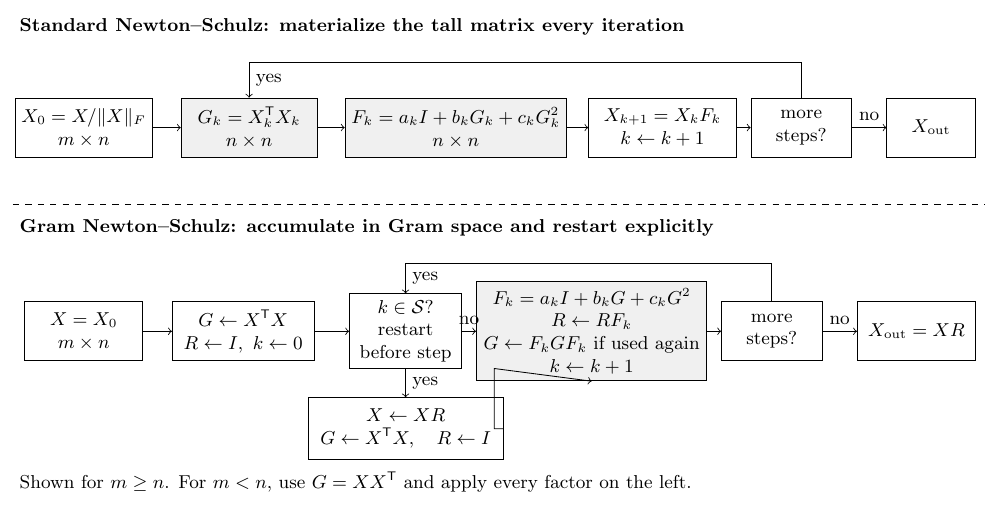
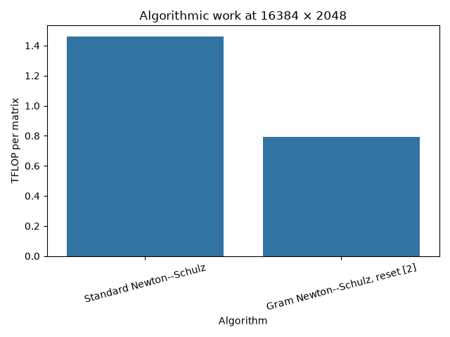
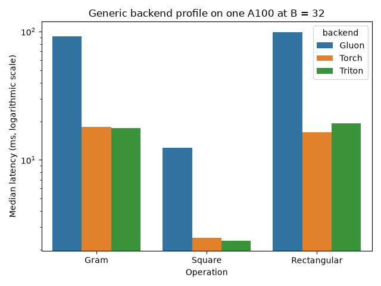
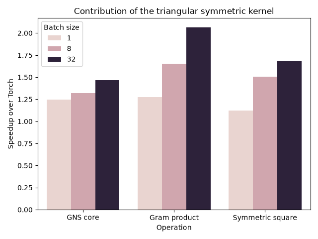
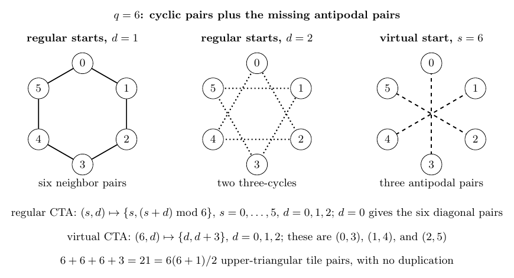
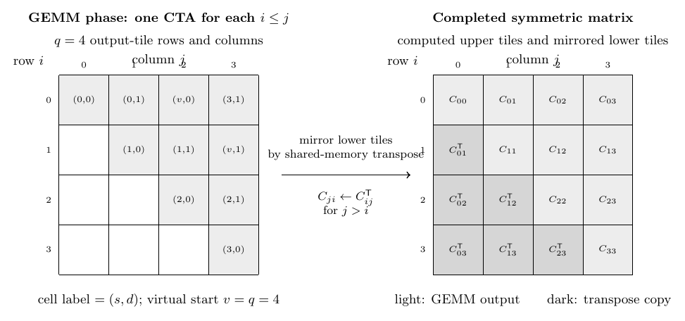
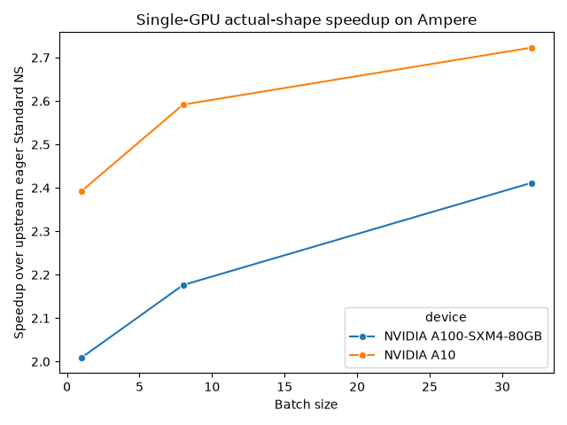

## Abstract

Newton--Schulz orthogonalization is a material part of the step time of Muon-like optimizers when it is applied to large parameter matrices [@muon; @newtonSchulz]. Gram--Newton--Schulz (GNS) changes the evaluation order of the same matrix polynomial: it accumulates most iterations on the smaller, square Gram matrix and applies their product to the original rectangular matrix only at selected resets [@gramNewtonSchulz]. This project asks a narrower systems question: how much of that algebraic advantage can be retained on NVIDIA Ampere GPUs, for which the Hopper-specific symmetric kernels in Quack are unavailable?

The work proceeded in two stages. First, Torch, Triton, Gluon, and ordinary CUTLASS implementations were measured, and generated code for the compiled kernel variants was disassembled. Those experiments showed that reducing arithmetic was not sufficient: the remaining square products had to expose their symmetric output structure, while rectangular products should remain on the mature vendor path. Second, the backend interface was changed to carry a caller-guaranteed symmetry contract. A CUTLASS SM80 kernel then computed exactly one triangular set of output thread blocks, using a cyclic scheduler with no discarded blocks, and a small CUDA kernel mirrored the computed triangle. On one A100, the final cleaned implementation took 3.635, 24.414, and 96.037 ms for batches 1, 8, and 32 of `16384 x 2048` matrices. These are same-run speedups of 1.952, 2.158, and 2.340 over the pinned eager Standard Newton--Schulz baseline. Separate A10 measurements found within-device speedups of 2.393--2.723. These results apply to warmed orthogonalization runs with BF16 inputs and outputs, FP16 working matrices, and FP32 accumulation. They do not cover cold compilation, arbitrary matrix distributions, or end-to-end training.

{#fig:overview width=100%}

## 1. The mathematical change is an evaluation-order change

Let the normalized working matrix be $X\in\mathbb{R}^{\ell\times d}$ with $\ell\ge d$. The implementation transposes the argument conceptually when necessary, so that $d$ is always the smaller dimension. It normalizes with an FP32 Frobenius norm, adds $\epsilon=10^{-7}$ in the benchmark configuration, and then performs the iteration in FP16. The result is cast back to the input dtype. Define

$$
R_t = X_t^\top X_t,
\qquad
F_t(R) = a_t I + b_t R + c_t R^2,
$$

where $(a_t,b_t,c_t)$ are the iteration coefficients. The measurements below use five `YOU_COEFFICIENTS` steps [@youCoefficients], not the package's default Polar Express coefficients [@polarExpress].

### 1.1 Standard Newton--Schulz

For a tall matrix, one Standard step is

$$
X_{t+1}=X_t F_t(R_t)
          =a_tX_t + X_t\left(b_tR_t+c_tR_t^2\right).
$$

For a wide matrix, the same polynomial acts from the left. In the implementation, each of five steps therefore contains three GEMMs: form the Gram matrix, square it while forming $b_tR_t+c_tR_t^2$, and multiply the polynomial into $X_t$. There are 15 GEMMs per input matrix.

For the benchmark shape $(\ell,d)=(16384,2048)$, counting a multiply-add as two floating-point operations gives

$$
5\left(4\ell d^2+2d^3\right)
=1.460289\times 10^{12}\ \text{FLOP per matrix}.
$$

The purpose of this count is comparative. It is not a claim that every issued instruction is useful, nor that the kernel reaches a fixed fraction of peak FLOP/s.

### 1.2 Gram--Newton--Schulz

GNS delays multiplication by the rectangular matrix. Within a segment between resets, it keeps an accumulated polynomial $Q$ and a Gram matrix $R$. With $Z_t=b_tR+c_tR^2$, the recurrence used here is

$$
\begin{aligned}
Q &\leftarrow QZ_t+a_tQ = QF_t(R),\\
S &\leftarrow RZ_t+a_tR = RF_t(R),\\
R &\leftarrow Z_tS+a_tS = F_t(R)RF_t(R).
\end{aligned}
$$

All of these square matrices are polynomials in the same symmetric Gram matrix. In exact arithmetic they commute and remain symmetric. Moreover, if the deferred rectangular iterate is $XQ$, then its Gram matrix is $Q^\top X^\top XQ$; the recurrence above produces the same object without materializing $XQ$ after every step. Thus GNS and Standard NS evaluate the same sequence of scalar polynomials on the singular values, subject to the selected reset policy [@gramNewtonSchulz].

Finite precision is the reason for the reset. The benchmark resets before zero-based iteration 2: it materializes $X\leftarrow XQ$, recomputes $R=X^\top X$, and restores $Q\leftarrow I$. It applies the remaining accumulated $Q$ once at the end. This limits drift in a long chain of low-precision Gram updates; it also adds two products involving the long dimension.

With five steps and this reset, the implementation executes 16 caller-guaranteed symmetric GEMMs and two rectangular GEMMs. Two of the symmetric calls are Gram formation or recomputation with the long reduction dimension; the other 14 symmetric calls have cubic $d$-dimension work. Equivalently, its arithmetic count is

$$
8\ell d^2+28d^3
=0.790274\times 10^{12}\ \text{FLOP per matrix}.
$$

The Standard-to-GNS arithmetic ratio is therefore $1.847826$. The measured end-to-end ratio can be lower because GNS issues more kernels and moves intermediate matrices, or higher if a symmetric implementation also executes the remaining work more efficiently. This distinction is important: the algorithm reduces arithmetic, while the triangular kernel changes how some of that arithmetic is scheduled.

{#fig:work-count width=72%}

## 2. Measurement protocol and comparison rules

The primary workload is a batch of BF16 matrices with shape `B x 16384 x 2048`, for $B\in\{1,8,32\}$. Every measurement uses exactly one GPU. Here $B$ is the number of matrices in one operator call, not the number of GPUs. Inputs are generated on the tested GPU with seed 67. The final triangular-kernel regressions and end-to-end A100/A10 tables use five warm-up calls followed by 20 CUDA-event samples; tables report the median. The earlier generic CUTLASS/Gluon diagnostic uses three warm-ups and ten samples and is reported only as a profiling experiment. The coefficients, epsilon, and reset are fixed as described above. Unless a table says otherwise, “Standard” is the literal upstream eager `StandardNewtonSchulz` at commit `e45d0aca7083cb275c9a303220c05c4abecd9187`, with Quack kernels disabled and `torch.compile` disabled. This baseline is deliberately simple and pinned; it is not the fastest conceivable Standard NS implementation.

The final single-GPU regression ran on exactly one NVIDIA A100-SXM4-80GB (SM80) under driver 595.71.05, PyTorch 2.11.0+cu130, and CUDA runtime 13.0. The feature baseline is commit `fbf6f5d`; the cleaned control-flow implementation is commit `4caa01d`. Raw final results are in `modal/symmetric-cutlass-results-2241582.json`. The separate Modal A10 run reports an NVIDIA A10 (SM86), the same PyTorch/CUDA versions, and approximately 22.06 GiB of usable device memory. At the time of writing, the symmetric implementation and its report remain on the local branch `refactor/ampere-symmetric-cutlass-cleanup`; commits `fbf6f5d` and `4caa01d` are not yet on the public repository's `main` branch. The hashes and artifact paths are stated now so that publication can later replace them with stable URLs without changing the provenance of the measurements.

Three comparison rules are used throughout:

1. **Within one benchmark run**, ratios between variants use the same device, input construction, timing method, and software environment. These are the strongest performance comparisons in this article.
2. **Across runs on the same GPU model**, a number is regression context only. Clock, host, process, cache, and code state can differ. For example, jobs `2241410` and `2241582` establish that cleanup did not materially change latency, but they should not be pooled as repeated samples.
3. **Across GPU models**, only within-device ratios are discussed. A10, A100, and H100 raw latencies are not comparable measurements of implementation quality. In particular, the historical H100 Quack result is not evidence for the Ampere CUTLASS kernel.

The timed regions exclude input generation, accuracy computation, output disposal, and first-time compilation. Earlier process-level observations found a roughly 29 s first call for the then-current CUTLASS variant at batch 1, which included JIT and process effects and was not guaranteed to start from an empty machine-wide cache. Cold-start behavior is consequently a separate concern from the steady-state tables.

## 3. Profiling before specialization

### 3.1 Torch and Triton established the algorithmic baseline

The first architecture sweep compared eager and compiled Torch, a conventional Triton `baddbmm`, and an ordinary CUTLASS batched GEMM. On A100, GNS already reduced time substantially relative to Standard NS. The fastest measured GNS backend was Triton at batch 1 (4.592 ms) and batch 32 (132.731 ms), while eager Torch was slightly faster for the intervening batches. The same-run Standard eager medians were 7.268 and 234.271 ms at batches 1 and 32. The important result was not a universal Triton advantage; it was that generic full-matrix backends clustered around the same performance range.

The Triton kernel uses `tl.dot`, three autotuned tile families, and a full rectangular output grid [@triton]. It does not exploit the caller's knowledge that many outputs are symmetric. Disassembly of the selected variants showed the expected tensor-core `HMMA` instructions and `LDGSTS` asynchronous global-to-shared transfers. This provided a useful compiler-generated baseline for staging and pipelining.

### 3.2 The Gluon experiment was a diagnostic, not a language verdict

A direct Gluon kernel was written with explicit `NVMMADistributedLayout`, operand layouts, and Ampere `mma_v2` instructions [@tritonGluon]. It was correct to approximately $10^{-5}$ relative error on the isolated operations, but it was much slower than Torch or Triton. In one A100 profiling subprocess at batch 32, the best tested Gluon tile took 12.441 ms for the square `baddbmm`, 91.538 ms for Gram formation, and 98.992 ms for the tall product. In the same subprocess, Triton took 2.361, 17.675, and 19.359 ms; Torch took 2.479, 18.082, and 16.339 ms.

The generated code suggests a mechanism for the gap. The examined Gluon variants used 122--244 registers and no `LDGSTS` instructions; loads were expressed as ordinary global loads rather than an asynchronously staged multi-buffer pipeline. Comparable Triton artifacts did contain `LDGSTS`. No Nsight trace or hardware-counter profile was collected, so this static evidence is diagnostic rather than a causal proof. These observations apply to this direct kernel and its layouts. They do not show that Gluon as a programming system is intrinsically slow. They instead show that writing an MMA instruction is not equivalent to supplying a good GEMM pipeline.

{#fig:generic-profile width=78%}

The exact cubins, PTX/TTGIR, SASS, and resource reports were retained under `modal/artifacts/gluon-exact-*`. Keeping generated code was useful because a timing alone could not distinguish an unsuitable tile from a missing memory pipeline.

### 3.3 Ordinary CUTLASS identified where specialization was useful

CUTLASS supplied a mature Ampere tensor-core main loop [@cutlass]. Initial profiling varied three full-GEMM tactics. At batch 32, tactic 0 reduced an isolated square `baddbmm` from Torch's 2.508 ms to 2.182 ms. Replacing the rectangular product was counterproductive: the best Torch measurement was 16.345 ms, whereas CUTLASS tactic 0 took 25.354 ms. A square-only hybrid reduced the GNS core from 104.823 to 99.955 ms in that profiling run; replacing all calls increased it.

This is why the final backend retains Torch/vendor GEMM for the rectangular applications. The custom work targets symmetric square outputs, for which a full GEMM computes information that the algorithm does not need twice.

{#fig:primitive-speedup width=78%}

## 4. Auditing Quack: portable structure versus Hopper mechanisms

The upstream GNS commit pins `quack-kernels==0.5.0`, corresponding to Quack commit `25b4b879b66cbab75ca127c5f5b1c3d84c84aadb` [@quack]. That implementation performs 16 symmetric GEMMs and two rectangular GEMMs. Its `TriangularTileScheduler` emits one output triangle, and its epilogue writes the mirrored transpose.

Quack's high-performance path is, however, designed for Hopper and later hardware. Its SM90 machinery uses TMA and WGMMA together with CTA clusters and multicast; related Hopper paths use persistent scheduling, and the upstream operator pipeline can use programmatic dependent launch. Quack's symmetric GEMM does **not** use the ping-pong schedule discussed for its general fused GEMM path. None of these Hopper execution mechanisms is a direct substitution on A100 [@nvidiaHopper; @nvidiaAmpere]. Quack 0.5.0 contains a nominal `GemmSm80` entry point whose call path terminates in `NotImplementedError`. Quack itself was therefore not benchmarked on A100.

The audit separated mechanisms from invariants. Four ideas do carry across architectures:

* schedule each unordered pair of output tiles once;
* choose one triangle as canonical and mirror it exactly;
* accept row-major and column-major views without materializing transposes; and
* leave non-symmetric rectangular products to a mature full GEMM.

The Ampere implementation reconstructs those invariants with CUTLASS 2.x-style SM80 components. It is not a port of Quack's Hopper kernel. Historical H100 Modal timings for upstream Quack—1.327, 8.981, and 35.482 ms at batches 1, 8, and 32—are retained only as within-H100 evidence that the upstream design is effective there. They must not be compared as raw latency with the A100 numbers or attributed to the CUTLASS implementation.

## 5. Carrying symmetry through a portable backend contract

The central software change is a semantic interface. A matrix backend exposes two operations whose **results** are guaranteed symmetric by the caller:

```text
symmetric_matmul(left, right)
symmetric_batch_matrix_matrix_product(
    left, right, accumulator, alpha, beta
)
```

The second means $\alpha LR+\beta C$ is symmetric. Neither $L$ nor $R$ needs to be symmetric in isolation. This distinction covers Gram products such as $X^\top X$ as well as the GNS polynomial recurrences. Torch and Triton may ignore the promise and compute the full output. CUTLASS may compute one triangle. The Newton--Schulz code does not contain tile or CUDA logic.

The promise is not checked at run time. Verifying it would require work comparable to reading or recomputing the output. A false promise therefore yields a well-formed but wrong result: the kernel treats the computed upper triangle as authoritative and reflects it. This is a conventional performance contract, but it belongs in the public backend protocol rather than in an undocumented kernel assumption.

`CutlassBackend` is a decorator around a Torch fallback. It attempts the triangular path only when dtype, device, shapes, alignments, and layouts are supported. Unsupported calls fall back to the portable backend. The full CUTLASS path is selected only for measured-favorable square products; rectangular products remain on Torch. This separation preserved mathematical portability and made dispatch policy explicit.

## 6. A cyclic scheduler for exactly the triangular CTAs

A CUDA thread block is called a cooperative thread array (CTA) in CUTLASS documentation. GEMM divides its output into rectangular tiles, and one CTA computes one tile. A conventional $T\times T$ grid launches $T^2$ CTAs for a square output. Skipping blocks below the diagonal still consumes launch slots and requires a branch. The desired grid instead contains exactly

$$
\frac{T(T+1)}{2}
$$

CTAs per matrix: one for every unordered pair of tile indices, including the diagonal.

The custom CUTLASS thread-block swizzle maps a rectangular physical grid to those unordered pairs. Let `blockIdx.x` be a cycle start $s$ and `blockIdx.y` a cyclic distance $d$.

* If $T$ is odd, launch $(T,(T+1)/2)$ blocks and map
  $(s,d)$ to the sorted pair $\{s,(s+d)\bmod T\}$.
* If $T$ is even, launch $(T+1,T/2)$ blocks. Starts $s<T$ use the same cyclic rule for distances $0,\ldots,T/2-1$. The sentinel start $s=T$ maps distance $d$ to the antipodal pair $\{d,d+T/2\}$.

For odd $T$, every nonzero circular distance up to $(T-1)/2$ selects one orientation of every off-diagonal pair. For even $T$, the sentinel supplies the otherwise ambiguous distance-$T/2$ pairs. Sorting makes the selected coordinate upper triangular. In both cases the physical grid has exactly $T(T+1)/2$ blocks. There is no inverse triangular-number calculation, square root, or discard branch in the CTA mapping.

The scheduler is implemented as a CUTLASS `GemmBatched` swizzle. `blockIdx.z` selects the batch. The main GEMM tile is `128 x 128 x 32`; each warp computes `64 x 64 x 32` work with an Ampere `16 x 8 x 16` tensor-core instruction. The pipeline uses three stages, eight-element operand alignment, FP32 accumulation, and vectorized FP16/BF16 output. A diagonal `128 x 128` block is still computed in full. Consequently the work approaches, but does not equal, one half as $T$ grows.

{#fig:cyclic-scheduler width=95%}

## 7. Layouts without transpose copies, followed by an exact mirror

{#fig:triangular-mirror width=95%}

### 7.1 CUTLASS layout variants

The symmetric kernel compiles three physical operand-layout combinations for each of FP16 and BF16:

* row-major/row-major (RR) for contiguous polynomial products;
* column-major/row-major (CR) for $X^\top X$ when tall $X$ is stored row-major; and
* row-major/column-major (RC) for $XX^\top$ when $X$ is wide.

The column-major operand is a view made by swapping strides; no transpose copy is needed. Both-column-major (CC) is rejected because it is not required by the GNS call patterns. The accumulator and output are contiguous row-major. Together with the two dtypes, these choices produce six symmetric CUTLASS variants.

Layout recognition is intentionally strict. A tensor must be contiguous row-major or have `stride(-2) == 1` and `stride(-1) == size(-2)` for column-major interpretation. Batch strides are passed through to CUTLASS. This supports the intended zero-copy views while avoiding a large and weakly tested stride surface.

### 7.2 Why mirroring is a second kernel

CUTLASS writes the upper `128 x 128` blocks. A separate CUDA kernel fills the lower triangle on the same stream. It uses the same cyclic scheduler at a finer `32 x 32` granularity. Each block has `32 x 8=256` threads. It stages an upper tile into `tile[32][33]` in shared memory and then writes its transpose. The extra column prevents shared-memory bank conflicts during the transposed access.

For off-diagonal blocks, the whole upper tile is copied into the corresponding lower tile. For a diagonal block, only entries with row index greater than column index are written; the original diagonal and upper entries remain unchanged. Bounds checks handle a final partial tile. Because the lower value is copied, not independently recomputed, every promised symmetric result is bitwise symmetric. The compiled mirror kernel uses 32 registers and 2,112 bytes of shared memory. Its extra launch and memory traffic are the principal cost of choosing a separate mirror rather than a fused epilogue.

The final A100 cubin contains six symmetric GEMM variants and two mirror variants. A symmetric CUTLASS variant contains 64 `HMMA` and 24 `LDGSTS` instructions in the retained SASS reports, with 240--254 registers depending on layout. These counts describe static generated code, not dynamically executed instruction totals.

## 8. Numerical validation

Performance measurements were gated on finite outputs, comparison with Torch GNS, output scale, an orthogonality residual, and exact symmetry for the internal square results. For output $Y\in\mathbb{R}^{\ell\times d}$, the reported residual is

$$
\frac{1}{\sqrt d}\left\|Y^\top Y-I\right\|_F,
$$

averaged across the batch. Relative error is the FP32 Frobenius norm of the difference divided by the reference norm.

On the final A100 run, triangular CUTLASS differed from Torch GNS by $7.32\times10^{-4}$ to $1.25\times10^{-3}$ across the reported batches. Every output was finite, output RMS rounded to 0.007832, and the residual ranged from 0.035409 to 0.035439. The pinned Standard implementation produced residuals from 0.035440 to 0.035534. These small differences are consistent with different low-precision reduction and materialization orders; they do not establish a general accuracy advantage for either method.

Every internal operation promised to be symmetric had maximum measured asymmetry exactly 0.0. That result is expected from copying the canonical triangle. It validates the storage invariant, not the mathematical accuracy of the canonical entries. The A10 run produced relative errors of $7.32\times10^{-4}$ to $1.33\times10^{-3}$ versus Torch GNS and the same rounded RMS and residual range.

No training run is reported. Kernel-level agreement and an orthogonality metric do not prove identical optimizer trajectories or downstream model quality.

## 9. Single-GPU performance on one A100 and one A10

### 9.1 Final 1× A100 result: same-run comparisons

The following table uses only records from Turing job `2241582`. Each row compares variants measured in that same job and process protocol.

| Batch | Standard eager (ms) | Torch GNS (ms) | Triangular CUTLASS GNS (ms) | Standard / CUTLASS | Torch GNS / CUTLASS |
|------:|--------------------:|---------------:|-----------------------------:|-------------------:|--------------------:|
| 1  | 7.096   | 4.068   | 3.635  | 1.952 | 1.119 |
| 8  | 52.680  | 30.669  | 24.414 | 2.158 | 1.256 |
| 32 | 224.756 | 130.180 | 96.037 | 2.340 | 1.356 |

: Final warmed medians on one A100. All ratios are within-run. {#tbl:a100}

{#fig:a100-latency width=78%}

The GNS-versus-Standard result combines two effects. The 1.8478 analytical work ratio comes from the algorithm. The additional gap at larger batches is consistent with avoiding lower-triangular GEMM CTAs. The comparison against Torch GNS isolates the implementation contribution more directly: 1.119--1.356 in this workload. At batch 1, the mirror launch and incomplete diagonal-block savings are a larger fraction of total time.

Isolated measurements from the final A100 cleanup run show the same scaling. The triangular symmetric square was 1.123, 1.505, and 1.689 times faster than Torch at batches 1, 8, and 32. Symmetric $X^\top X$ was 1.276, 1.653, and 2.066 times faster. The full GNS core improved by 1.245--1.466. These operation-level measurements share job `2241582` with the final table, but each speedup still compares only like-for-like timed regions.

### 9.2 One-A10 compatibility and performance: a separate run

The Modal A10 benchmark used the same matrix shape and statistical protocol, but it is a distinct environment and an earlier cleaned source state. Its ratios are valid within each A10 row; its raw milliseconds must not be compared with A100.

| Batch | A10 Standard eager (ms) | A10 triangular CUTLASS GNS (ms) | Within-A10 speedup |
|------:|------------------------:|---------------------------------:|-------------------:|
| 1  | 24.714   | 10.330  | 2.393 |
| 8  | 219.534  | 84.705  | 2.592 |
| 32 | 1036.784 | 380.770 | 2.723 |

: Separate warmed medians on one SM86 A10. Ratios are within-device and within-run. {#tbl:a10}

Batch 32 fit only after accuracy was computed one batch item at a time and completed variant outputs were released; both changes occurred outside timed regions. This result establishes that the `compute_80` PTX path executed on one SM86 GPU. It does not establish performance on all major-8 devices, and an A10 is not an RTX 3090 timing proxy.

{#fig:speedup width=82%}

## 10. Cleanup as a performance regression exercise

Kernel work often accumulates dispatch helpers, duplicated formulas, and names that encode implementation history rather than mathematical intent. Cleanup was therefore treated as a measured change, not as a stylistic assumption.

An early kernel/wrapper pass reduced the CUDA source from 434 to 383 lines and the Python wrapper from 315 to 290 lines. It removed an unused CC specialization, reducing the JIT shared object from 907,792 to 802,192 bytes. A generator-expression version of support checking briefly regressed the batch-1 core from about 2.918 to 3.185 ms; direct checks restored the original behavior. This episode is a reminder that host dispatch is observable when a GPU operator contains many short kernel launches.

The subsequent `4caa01d` refactor removed a one-use Muon factory, retained the two operation builders that form meaningful `torch.compile` boundaries, removed a one-use Modal subprocess wrapper, deduplicated the CUDA grid formula, and replaced generic coefficient and scheduling names with mathematical or cyclic terms. It also documented the caller-guaranteed symmetry contract and preserved explicit validation and rectangular fallback policy.

Relative to feature job `2241410`, the cleaned job changed end-to-end CUTLASS time by +0.24%, -0.02%, and -0.05% at batches 1, 8, and 32. All triangular primitive and end-to-end changes were within 0.95%; core changes were within 0.11%. More strongly, the produced SASS and resource dumps were byte-identical. The separate runs cannot prove zero performance change, but the identical device code and sub-percent timing differences provide evidence that the refactor changed host organization rather than the GPU algorithm.

## 11. Limitations and open work

The current result has a deliberately narrow contract.

* **Hardware and dtype.** The direct kernel accepts CUDA compute-capability major 8 and FP16 or BF16. It was measured only on A100/SM80 and A10/SM86. FlashInfer JIT is required to compile native SM80 code plus `compute_80` PTX [@flashinfer].
* **Shapes and layouts.** Direct primitives require rank-3 batched tensors, matching devices/dtypes/batches, square symmetric output, contiguous row-major accumulator/output, recognized row- or column-major operands, 16-byte-aligned base pointers, and relevant dimensions and batch strides aligned to eight. CC input layout is unsupported. Backend calls fall back to Torch; direct primitive calls raise.
* **Trusted symmetry.** The backend cannot verify the symmetry promise cheaply. Misuse silently reflects an arbitrary upper triangle.
* **Batch-grid limit.** The CUTLASS swizzle caps `grid.z` at 65,535 without a batch-stride loop, while the mirror launch uses the batch count directly. Extremely large batch counts are not safely supported or explicitly rejected.
* **Residual work.** Diagonal `128 x 128` blocks are computed in full. Mirroring requires a second launch and an additional read/write. High register counts (240--254 in the symmetric GEMMs) can limit occupancy. These costs explain the smaller gain at low batch or small tile count.
* **Fallback is part of the design.** The two rectangular GNS applications intentionally stay on Torch/vendor GEMM. The CUTLASS backend itself is not wrapped in `torch.compile`; only the pure Torch backend uses that compile policy.
* **Benchmark coverage.** The performance study fixes one large aspect ratio, one random seed, one coefficient sequence, one reset, and three batch sizes. It does not sweep smaller optimizer matrices, irregular strides, power/clock state, or concurrent workloads. The final A100 job did not sample peak memory.
* **Cold start and CI.** Steady-state numbers exclude JIT compilation. The custom CUTLASS path currently has benchmark smoke validation but no dedicated tests under `tests/`, leaving ordinary CI coverage incomplete.
* **Optimizer evidence.** Muon and Dion3 integration, distributed layouts, and state handling are outside the measured kernel comparison. No claim about training throughput or final model accuracy follows from these operator timings.

The most useful next experiments would sweep the smaller dimension and aspect ratio, add a cold-cache compilation protocol, measure power and achieved memory/tensor-core utilization, test more SM8x devices, and introduce device tests for layout/fallback and false-contract failure cases. A fused mirror epilogue would remove one launch, but it should be compared against the present separate kernel rather than assumed faster.

## 12. Conclusion

The Ampere result follows from separating three questions. Algebra determines which work can be moved from the rectangular iterate to its smaller Gram matrix. The backend contract determines where symmetry is known. The kernel scheduler determines whether that knowledge removes actual CTAs rather than merely adding a branch. Profiling also showed where not to specialize: a direct MMA kernel without a memory pipeline was uncompetitive, and custom rectangular CUTLASS products lost to the existing vendor path.

For the measured `B x 16384 x 2048` BF16 workload, GNS reduces the analytical work by 1.8478, and the triangular CUTLASS implementation raises the same-run A100 speedup over pinned eager Standard NS to 1.952--2.340. The independent A10 run supports the portability of the basic SM80/PTX design within the tested Ampere devices. These are steady-state operator results under a specific coefficient and reset policy. Their main systems implication is more general: an algebraic invariant becomes useful to a GPU kernel only when software carries it explicitly to scheduling and layout decisions.

## References

::: {#refs}
:::
